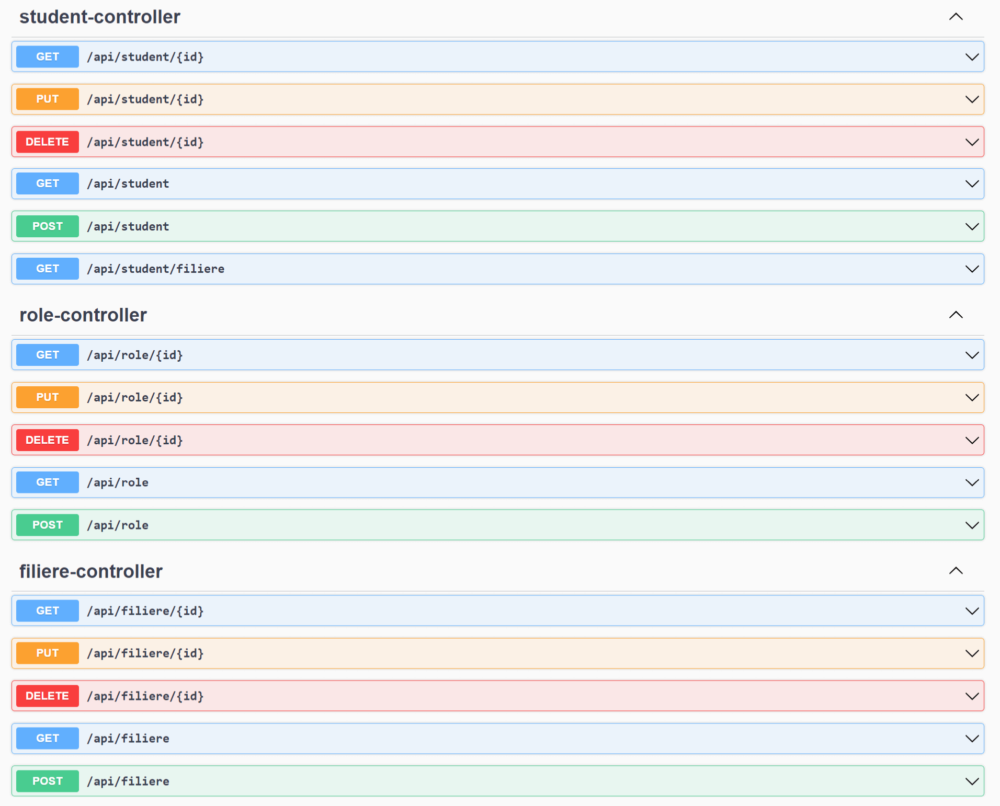
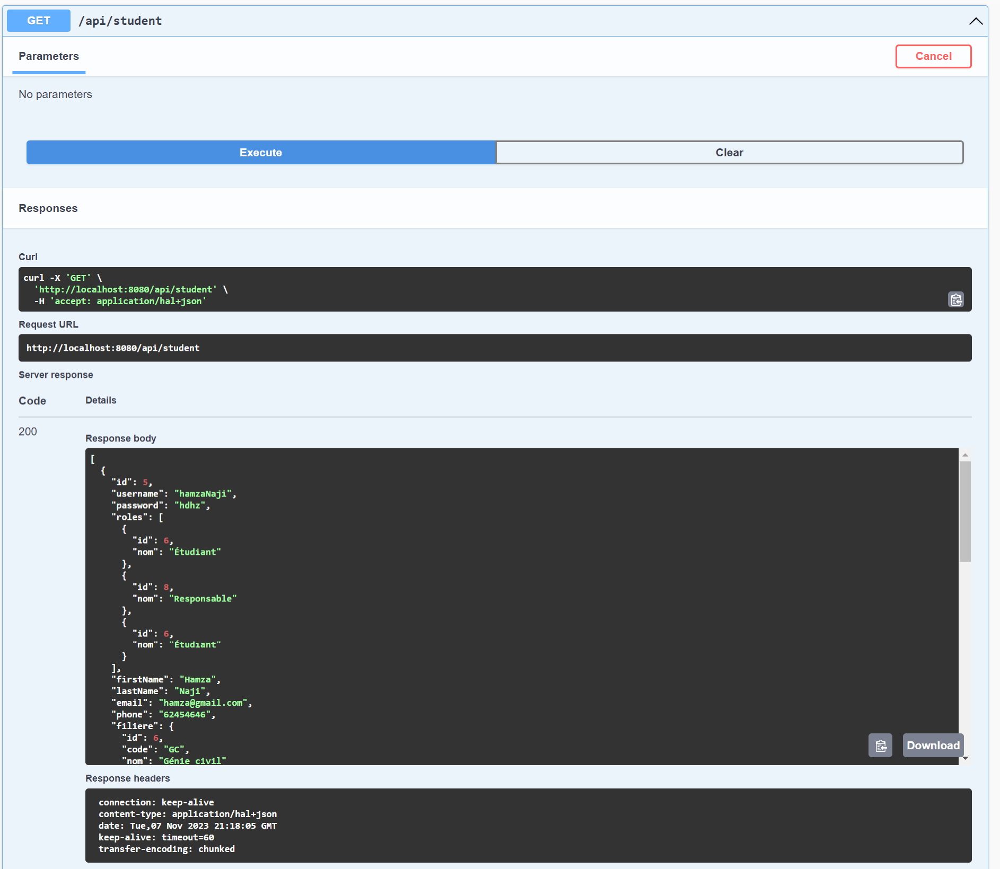
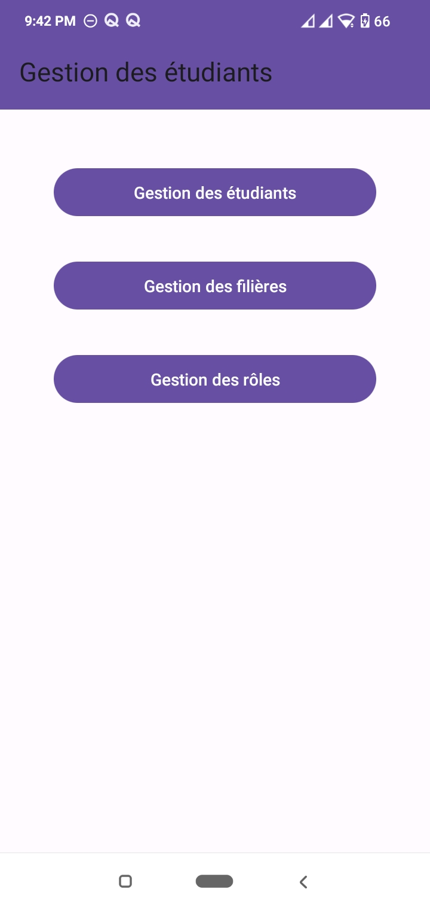
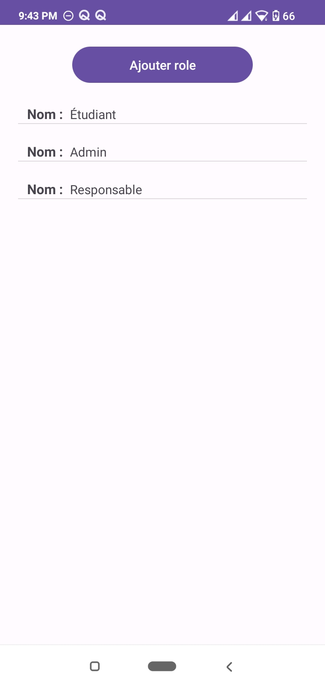
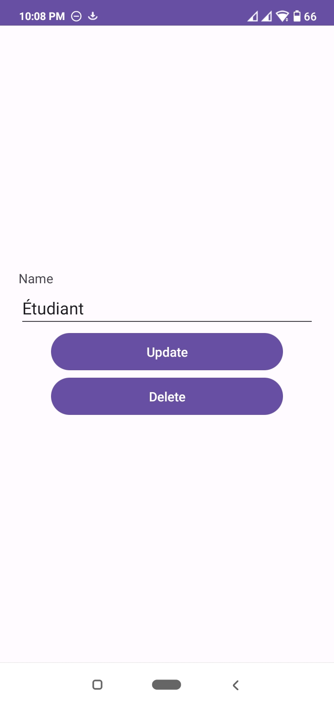
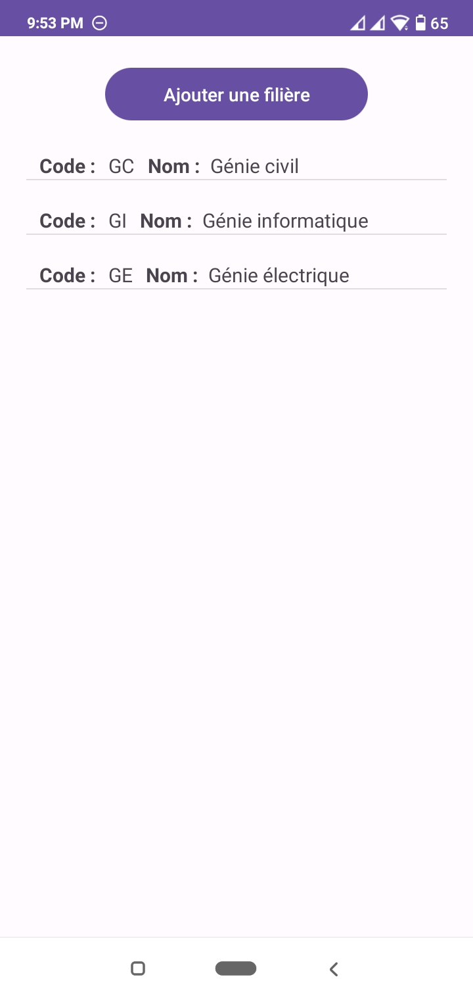
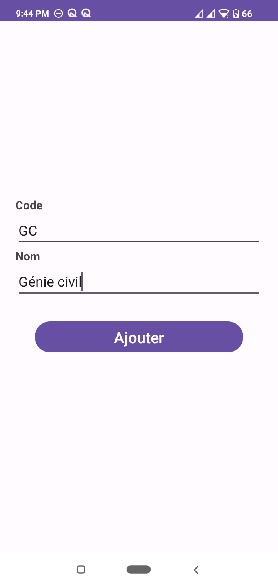
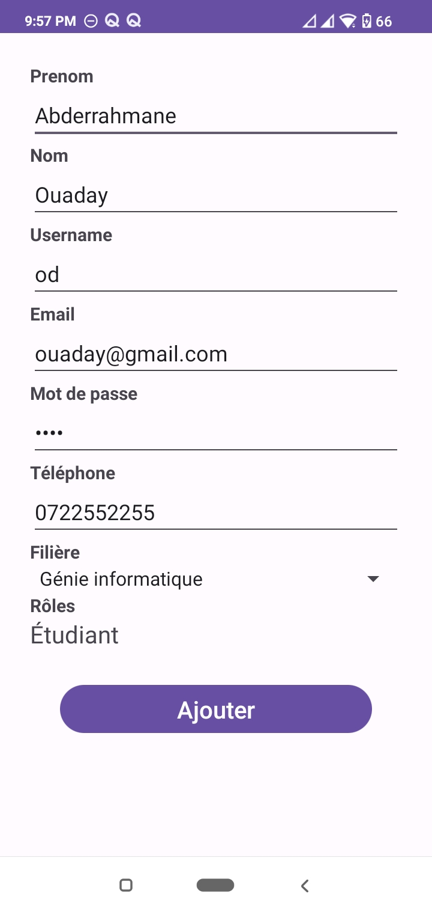
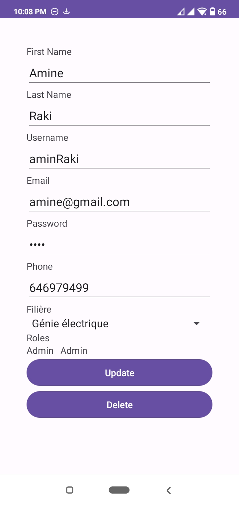
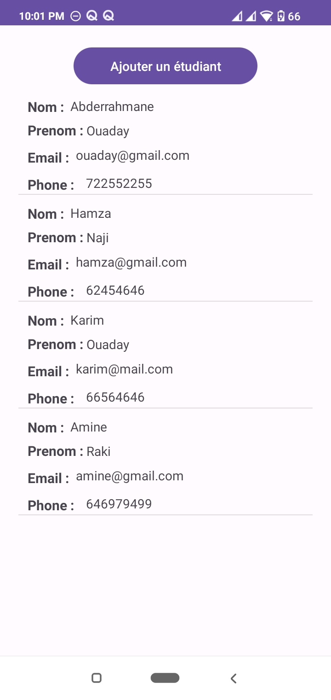

# Spring Boot with Android

# Swagger
### 1. Interface Swagger

### 2. Get Student

# Application mobile
### 1. Home page
   

### 2. Rôle
          

### 3. Filière
       
   
### 3. Etudiant
        
